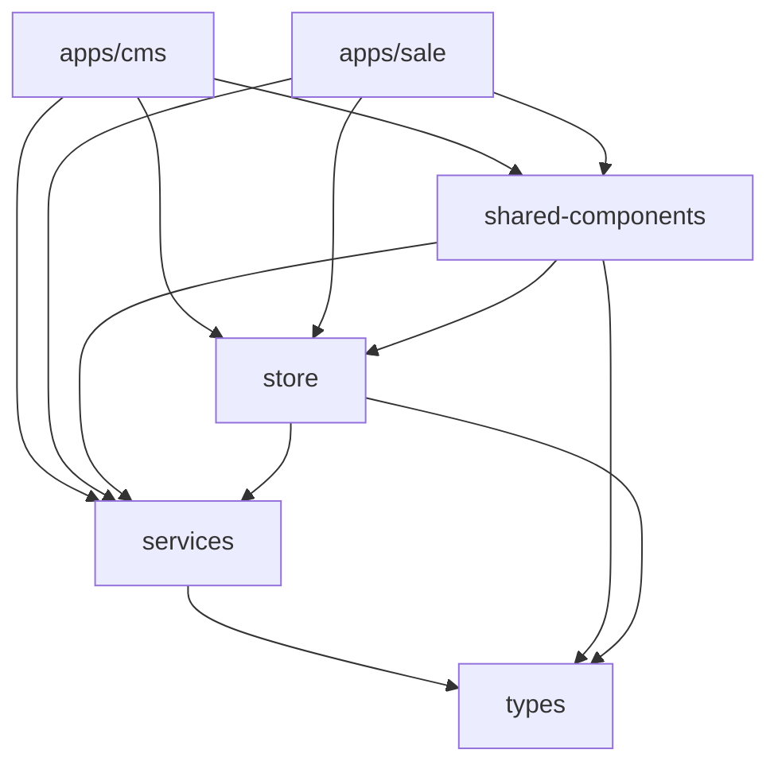

# Kiến Trúc Workspace

Nam Việt ERP được xây dựng dựa trên **Yarn Workspace Monorepo**, cung cấp một codebase tập trung cho nhiều ứng dụng và package dùng chung.

## 📦 Cấu Trúc Monorepo

```
nam-viet-erp/
├── apps/                    # Các package ứng dụng
│   ├── cms/                # Hệ Thống Quản Lý (Admin)
│   └── sale/               # Ứng Dụng Bán Hàng (POS, B2B)
├── packages/               # Các package dùng chung
│   ├── services/          # API services & business logic
│   ├── shared-components/ # UI components & screens tái sử dụng
│   ├── store/            # Quản lý state (Zustand stores)
│   └── types/            # TypeScript type definitions
├── documents/             # Tài liệu
├── database/             # Scripts & migrations database
├── types/               # Type definitions toàn cục
└── package.json        # Cấu hình workspace gốc
```

## 🎯 Nguyên Tắc Thiết Kế

### 1. **Phân Tách Mối Quan Tâm**

- **Apps**: Code riêng cho từng ứng dụng (routing, layouts, entry points)
- **Packages**: Code tái sử dụng giữa các apps
- **Services**: Business logic và API integration
- **Store**: Quản lý state và data caching

### 2. **Tái Sử Dụng Code**

- Shared UI components dùng chung cho cả CMS và Sale apps
- Một package services cho tất cả API interactions
- Quản lý state tập trung
- Phát triển type-safe với shared types

### 3. **Triển Khai Độc Lập**

- Các apps có thể build và deploy độc lập
- Shared packages được compile một lần và tái sử dụng
- Version control ở cấp package

## 📱 Ứng Dụng

### CMS App (`apps/cms`)

**Mục đích**: Giao diện quản trị cho quản lý hệ thống

**Tính năng**:

- Quản lý sản phẩm (CRUD)
- Kiểm soát tồn kho
- Quản lý người dùng & phân quyền
- Báo cáo và phân tích
- Cấu hình hệ thống

**Công nghệ**:

- React + TypeScript
- Vite (build tool)
- Ant Design (UI framework)
- React Router (routing)

**Entry Point**: `apps/cms/src/main.tsx`

### Sale App (`apps/sale`)

**Mục đích**: Ứng dụng tập trung vào bán hàng cho nhân viên

**Tính năng**:

- Point of Sale (POS)
- Quản lý đơn hàng B2B
- Quản lý khách hàng
- Đơn thuốc y tế
- Tra cứu tồn kho

**Công nghệ**:

- React + TypeScript
- Vite (build tool)
- Ant Design (UI framework)
- React Router (routing)

**Entry Point**: `apps/sale/src/main.tsx`

## 📦 Shared Packages

### Services (`packages/services`)

**Mục đích**: Tập trung API communication và business logic

**Trách nhiệm**:

- Cấu hình Supabase client
- Hàm API service
- Chuyển đổi dữ liệu
- Xử lý lỗi
- Quản lý SQL query

**Module Chính**:

```
services/
├── src/
│   ├── index.ts              # Main exports
│   ├── supabaseClient.ts     # Cấu hình Supabase
│   ├── productService.ts     # Thao tác CRUD sản phẩm
│   ├── inventoryService.ts   # Quản lý tồn kho
│   ├── orderService.ts       # Xử lý đơn hàng
│   ├── patientService.ts     # Quản lý bệnh nhân/khách hàng
│   └── lotManagementService.ts  # Theo dõi lô sản phẩm
└── query/                     # SQL query templates
    ├── products.txt
    ├── inventory.txt
    └── orders.txt
```

**Ví dụ sử dụng**:

```typescript
import { getProducts, createProduct } from "@nam-viet-erp/services";

// Lấy danh sách sản phẩm
const { data, error } = await getProducts({ status: "active" });

// Tạo sản phẩm mới
const result = await createProduct(productData);
```

### Shared Components (`packages/shared-components`)

**Mục đích**: UI components và screens tái sử dụng

**Cấu trúc**:

```
shared-components/
├── src/
│   ├── components/        # UI components tái sử dụng
│   │   ├── ProductForm.tsx
│   │   ├── ProductLotManagement.tsx
│   │   ├── PosTabContent.tsx
│   │   └── ...
│   ├── screens/          # Screens toàn trang
│   │   ├── pos/         # POS screens
│   │   ├── inventory/   # Inventory screens
│   │   ├── b2b/        # B2B screens
│   │   └── medical/    # Medical screens
│   ├── providers/       # React context providers
│   │   └── ScreenProvider.tsx
│   ├── utils/          # Utility functions
│   │   └── menuGenerator.ts
│   └── index.ts       # Main exports
```

**Kiến Trúc Screen**: Xem [Kiến Trúc Shared Screens](./shared-screens.md)

### Store (`packages/store`)

**Mục đích**: Quản lý state tập trung sử dụng Zustand

**Stores Chính**:

1. **Entity Store** (`entityStore.ts`)
   - Lưu trữ dữ liệu chuẩn hóa
   - Sản phẩm, lô hàng, tồn kho
   - Tự động đồng bộ giữa các màn hình
   - Xem: [Quản Lý State](./state-management-vi.md)

2. **POS Store** (`posStore.ts`)
   - Quản lý giỏ hàng đa tab
   - Chọn khách hàng
   - Xử lý thanh toán

3. **Auth Store** (`authStore.ts`)
   - State xác thực người dùng
   - Quản lý session
   - Quyền hạn

4. **Employee Store** (`employeeStore.ts`)
   - Dữ liệu nhân viên
   - Phân công kho hàng
   - Thông tin vai trò

5. **Combo Store** (`comboStore.ts`)
   - Quản lý combo sản phẩm
   - Phát hiện combo trong giỏ hàng

**Ví dụ sử dụng**:

```typescript
import { usePosStore, useEntityProduct } from "@nam-viet-erp/store";

// Sử dụng POS store
const { cart, addCartItem } = usePosStore();

// Đăng ký nhận sản phẩm cụ thể
const product = useEntityProduct(productId);
```

## 🔗 Phụ Thuộc Package



## 🛠️ Cấu Hình Workspace

### Root `package.json`

```json
{
  "name": "nam-viet-erp-monorepo",
  "private": true,
  "workspaces": ["apps/*", "packages/*"],
  "scripts": {
    "cms:dev": "yarn workspace @nam-viet-erp/cms dev",
    "cms:build": "yarn workspace @nam-viet-erp/cms build",
    "sale:dev": "yarn workspace @nam-viet-erp/sale dev",
    "sale:build": "yarn workspace @nam-viet-erp/sale build",
    "lint": "yarn workspace @nam-viet-erp/sale lint && yarn workspace @nam-viet-erp/cms lint"
  }
}
```

### Cấu Hình TypeScript

- Root `tsconfig.json`: Cấu hình TypeScript cơ bản
- Mỗi package có `tsconfig.json` riêng kế thừa từ root
- Path aliases được cấu hình cho imports:
  ```typescript
  import { ProductForm } from "@nam-viet-erp/shared-components";
  import { getProducts } from "@nam-viet-erp/services";
  import { usePosStore } from "@nam-viet-erp/store";
  ```

## 🚀 Quy Trình Phát Triển

### Bắt Đầu Phát Triển

```bash
# Cài đặt tất cả dependencies
yarn install

# Chạy CMS app
yarn cms:dev

# Chạy Sale app
yarn sale:dev

# Chạy linting
yarn lint
```

### Build cho Production

```bash
# Build CMS app
yarn cms:build

# Build Sale app
yarn sale:build

# Kết quả build:
# - apps/cms/dist/
# - apps/sale/dist/
```

### Thêm Package Mới

1. Tạo thư mục package trong `packages/` hoặc `apps/`
2. Thêm `package.json` với tên phù hợp (`@nam-viet-erp/package-name`)
3. Cài đặt dependencies: `yarn install`
4. Import trong các package khác sử dụng workspace name

## 📋 Best Practices

### 1. **Tổ Chức Package**

- Giữ packages tập trung và single-purpose
- Tránh circular dependencies
- Sử dụng barrel exports (`index.ts`) cho imports sạch

### 2. **Import Giữa Các Package**

```typescript
// ✅ Đúng - Sử dụng workspace names
import { ProductForm } from "@nam-viet-erp/shared-components";
import { getProducts } from "@nam-viet-erp/services";

// ❌ Sai - Đường dẫn tương đối giữa các packages
import { ProductForm } from "../../../packages/shared-components/src/components/ProductForm";
```

### 3. **Quản Lý Version**

- Shared packages sử dụng cùng major version
- Apps có thể có version độc lập
- Sử dụng `yarn.lock` cho dependencies nhất quán

### 4. **Chia Sẻ Code**

- UI components → `shared-components`
- Business logic → `services`
- State → `store`
- Types → `types` hoặc `packages/types`

## 🔄 Chiến Lược Migration

Khi di chuyển code giữa các packages:

1. **Xác định shared code** trong apps
2. **Trích xuất vào package phù hợp**:
   - UI → shared-components
   - Logic → services
   - State → store
3. **Cập nhật imports** trong code sử dụng
4. **Test kỹ lưỡng** trong cả hai apps
5. **Xóa code trùng lặp** khỏi apps

## 🎯 Mở Rộng Tương Lai

Monorepo được thiết kế để dễ dàng thêm:

- Ứng dụng mới (mobile app, admin portal)
- Shared packages mới (analytics, notifications)
- Tích hợp bên thứ ba
- Micro-frontends

## 📚 Tài Liệu Liên Quan

- [Kiến Trúc Shared Screens](./shared-screens.md)
- [Quản Lý State](./state-management-vi.md)
- [Quy Tắc Phát Triển](../development/rules-vi.md)
- [Tổng Quan Services](../api/services-overview.md)
