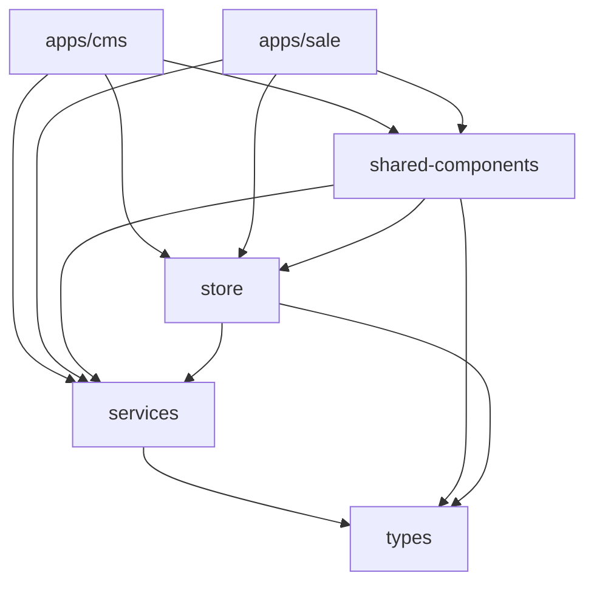

# Workspace Architecture

Nam Việt ERP is built as a **Yarn Workspace Monorepo**, providing a centralized codebase for multiple applications and shared packages.

## 📦 Monorepo Structure

```
nam-viet-erp/
├── apps/                    # Application packages
│   ├── cms/                # Content Management System (Admin)
│   └── sale/               # Sales Application (POS, B2B)
├── packages/               # Shared packages
│   ├── services/          # API services & business logic
│   ├── shared-components/ # Reusable UI components & screens
│   ├── store/            # State management (Zustand stores)
│   └── types/            # TypeScript type definitions
├── documents/             # Documentation
├── database/             # Database scripts & migrations
├── types/               # Global type definitions
└── package.json        # Root workspace configuration
```

## 🎯 Design Principles

### 1. **Separation of Concerns**

- **Apps**: Application-specific code (routing, layouts, entry points)
- **Packages**: Reusable code shared across apps
- **Services**: Business logic and API integration
- **Store**: State management and data caching

### 2. **Code Reusability**

- Shared UI components used by both CMS and Sale apps
- Single services package for all API interactions
- Centralized state management
- Type-safe development with shared types

### 3. **Independent Deployment**

- Apps can be built and deployed independently
- Shared packages are compiled once and reused
- Version control at package level

## 📱 Applications

### CMS App (`apps/cms`)

**Purpose**: Administrative interface for system management

**Features**:

- Product management (CRUD)
- Inventory control
- User & permission management
- Reports and analytics
- System configuration

**Tech Stack**:

- React + TypeScript
- Vite (build tool)
- Ant Design (UI framework)
- React Router (routing)

**Entry Point**: `apps/cms/src/main.tsx`

### Sale App (`apps/sale`)

**Purpose**: Sales-focused application for staff

**Features**:

- Point of Sale (POS)
- B2B order management
- Customer management
- Medical prescriptions
- Inventory lookup

**Tech Stack**:

- React + TypeScript
- Vite (build tool)
- Ant Design (UI framework)
- React Router (routing)

**Entry Point**: `apps/sale/src/main.tsx`

## 📦 Shared Packages

### Services (`packages/services`)

**Purpose**: Centralized API communication and business logic

**Responsibilities**:

- Supabase client configuration
- API service functions
- Data transformation
- Error handling
- SQL query management

**Key Modules**:

```
services/
├── src/
│   ├── index.ts              # Main exports
│   ├── supabaseClient.ts     # Supabase configuration
│   ├── productService.ts     # Product CRUD operations
│   ├── inventoryService.ts   # Inventory management
│   ├── orderService.ts       # Order processing
│   ├── patientService.ts     # Patient/customer management
│   └── lotManagementService.ts  # Product lot tracking
└── query/                     # SQL query templates
    ├── products.txt
    ├── inventory.txt
    └── orders.txt
```

**Usage Example**:

```typescript
import { getProducts, createProduct } from "@nam-viet-erp/services";

// Fetch products
const { data, error } = await getProducts({ status: "active" });

// Create product
const result = await createProduct(productData);
```

### Shared Components (`packages/shared-components`)

**Purpose**: Reusable UI components and screens

**Structure**:

```
shared-components/
├── src/
│   ├── components/        # Reusable UI components
│   │   ├── ProductForm.tsx
│   │   ├── ProductLotManagement.tsx
│   │   ├── PosTabContent.tsx
│   │   └── ...
│   ├── screens/          # Full page screens
│   │   ├── pos/         # POS screens
│   │   ├── inventory/   # Inventory screens
│   │   ├── b2b/        # B2B screens
│   │   └── medical/    # Medical screens
│   ├── providers/       # React context providers
│   │   └── ScreenProvider.tsx
│   ├── utils/          # Utility functions
│   │   └── menuGenerator.ts
│   └── index.ts       # Main exports
```

**Screen Architecture**: See [Shared Screens Architecture](./shared-screens.md)

### Store (`packages/store`)

**Purpose**: Centralized state management using Zustand

**Key Stores**:

1. **Entity Store** (`entityStore.ts`)
   - Normalized data storage
   - Products, lots, inventory
   - Auto-sync across screens
   - See: [State Management](./state-management.md)

2. **POS Store** (`posStore.ts`)
   - Multi-tab cart management
   - Customer selection
   - Payment processing

3. **Auth Store** (`authStore.ts`)
   - User authentication state
   - Session management
   - Permissions

4. **Employee Store** (`employeeStore.ts`)
   - Employee data
   - Warehouse assignments
   - Role information

5. **Combo Store** (`comboStore.ts`)
   - Product combo management
   - Combo detection in cart

**Usage Example**:

```typescript
import { usePosStore, useEntityProduct } from "@nam-viet-erp/store";

// Use POS store
const { cart, addCartItem } = usePosStore();

// Subscribe to specific product
const product = useEntityProduct(productId);
```

## 🔗 Package Dependencies



## 🛠️ Workspace Configuration

### Root `package.json`

```json
{
  "name": "nam-viet-erp-monorepo",
  "private": true,
  "workspaces": ["apps/*", "packages/*"],
  "scripts": {
    "cms:dev": "yarn workspace @nam-viet-erp/cms dev",
    "cms:build": "yarn workspace @nam-viet-erp/cms build",
    "sale:dev": "yarn workspace @nam-viet-erp/sale dev",
    "sale:build": "yarn workspace @nam-viet-erp/sale build",
    "lint": "yarn workspace @nam-viet-erp/sale lint && yarn workspace @nam-viet-erp/cms lint"
  }
}
```

### TypeScript Configuration

- Root `tsconfig.json`: Base TypeScript configuration
- Each package has its own `tsconfig.json` extending the root
- Path aliases configured for imports:
  ```typescript
  import { ProductForm } from "@nam-viet-erp/shared-components";
  import { getProducts } from "@nam-viet-erp/services";
  import { usePosStore } from "@nam-viet-erp/store";
  ```

## 🚀 Development Workflow

### Starting Development

```bash
# Install all dependencies
yarn install

# Start CMS app
yarn cms:dev

# Start Sale app
yarn sale:dev

# Run linting
yarn lint
```

### Building for Production

```bash
# Build CMS app
yarn cms:build

# Build Sale app
yarn sale:build

# Build output:
# - apps/cms/dist/
# - apps/sale/dist/
```

### Adding New Packages

1. Create package folder in `packages/` or `apps/`
2. Add `package.json` with proper name (`@nam-viet-erp/package-name`)
3. Install dependencies: `yarn install`
4. Import in other packages using workspace name

## 📋 Best Practices

### 1. **Package Organization**

- Keep packages focused and single-purpose
- Avoid circular dependencies
- Use barrel exports (`index.ts`) for clean imports

### 2. **Cross-Package Imports**

```typescript
// ✅ Good - Use workspace names
import { ProductForm } from "@nam-viet-erp/shared-components";
import { getProducts } from "@nam-viet-erp/services";

// ❌ Bad - Relative paths across packages
import { ProductForm } from "../../../packages/shared-components/src/components/ProductForm";
```

### 3. **Version Management**

- Shared packages use same major version
- Apps can have independent versions
- Use `yarn.lock` for consistent dependencies

### 4. **Code Sharing**

- UI components → `shared-components`
- Business logic → `services`
- State → `store`
- Types → `types` or `packages/types`

## 🔄 Migration Strategy

When moving code between packages:

1. **Identify shared code** in apps
2. **Extract to appropriate package**:
   - UI → shared-components
   - Logic → services
   - State → store
3. **Update imports** in consuming code
4. **Test thoroughly** in both apps
5. **Remove duplicates** from apps

## 🎯 Future Expansion

The monorepo is designed to easily add:

- New applications (mobile app, admin portal)
- New shared packages (analytics, notifications)
- Third-party integrations
- Micro-frontends

## 📚 Related Documentation

- [Shared Screens Architecture](./shared-screens.md)
- [State Management](./state-management.md)
- [Development Rules](../development/rules.md)
- [Services Overview](../api/services-overview.md)
